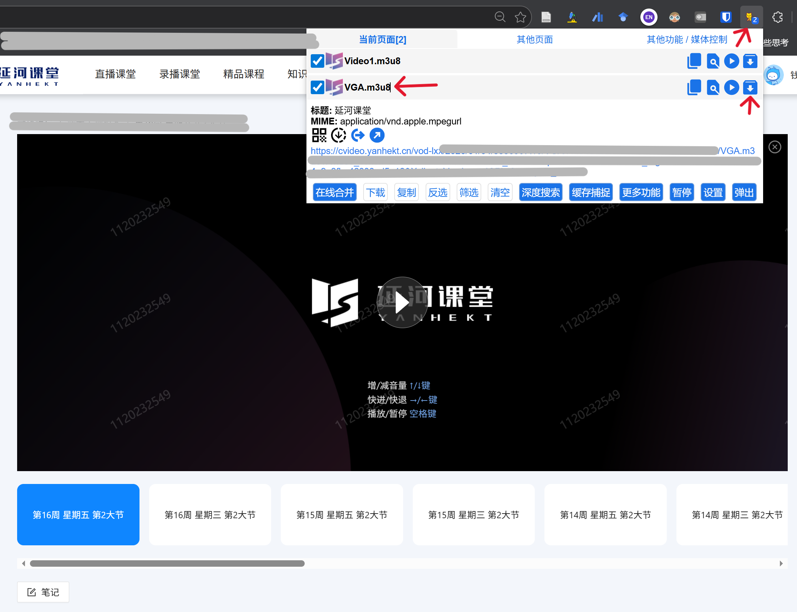

# 影幻智提 (VidSlide)

> 从延河课堂录屏视频中，一键智能提取 PPT 幻灯片。


## 这是什么？

延河课堂的录播视频只能在线看，没有现成的 PPT 下载。
**影幻智提** 帮你从下载好的桌面录屏视频中，自动识别每一页 PPT 翻页，提取出清晰的幻灯片图片，然后打包成 PDF / PPTX / ZIP 供你离线复习。

> **注意：** 本工具专为**桌面录屏**（屏幕录制）设计，不适用于摄像头拍摄的教室视频。

## 前置步骤：先获取视频文件

延河课堂的录播视频需要借助浏览器插件下载到本地，**推荐使用 [猫抓 (cat-catch)](https://github.com/xifangczy/cat-catch)**（开源，支持 Chrome / Edge / Firefox）。

> 也可以使用 [Video DownloadHelper](https://www.downloadhelper.net/) 等其他视频下载插件。

### 以猫抓为例

1. 从 [猫抓 GitHub](https://github.com/xifangczy/cat-catch) 或浏览器扩展商店安装猫抓插件
2. 进入延河课堂的**录播课程页面**，刷新页面
3. 点击浏览器工具栏的猫抓图标，会嗅探到**两个视频**：
   - `video1.m3u8` — 这是**摄像头录播**（拍教室的，不需要）
   - `VGA.m3u8` — 这是**屏幕录播**（PPT 画面，我们要下载的）

   

4. 点击 **VGA.m3u8** 旁边的下载按钮
5. 第一次使用猫抓下载时会弹出两个页面，**不用点击任何按钮**，等待猫抓自动完成下载
6. 下载完成后选择保存位置，确认该视频是屏幕录制画面后，即可使用本工具提取 PPT

## 快速开始

> ⚠️ **重要提示：** v0.1.0 和 v0.1.1 存在刷新页面导致后端进程退出的 Bug（显示"网络连接错误"），请升级到 **v0.2.1** 或更新版本。

### 方式一：下载 exe 直接使用（推荐）

1. 👉 前往 [**Releases**](../../releases) 页面，下载最新版 `VidSlide.exe`
2. 双击运行，浏览器自动打开工具页面
3. 选择视频 → 调参数 → 提取 → 整理排序 → 导出

> **⚠️ 首次运行会遇到 Windows 安全提示，这是正常的！**
>
> 因为本工具是个人开源项目，没有购买商业代码签名证书（年费 $200+），所以 Windows SmartScreen 会弹出警告。**程序本身是安全的**，源码完全公开可审查。
>
> **绕过方法：**
> 1. 下载 exe 后，Windows 可能提示"已阻止下载" → 点击 **保留**（或点 `···` → 保留）
> 2. 双击运行时弹出蓝色窗口"Windows 已保护你的电脑" → 点击 **「更多信息」** → 再点击 **「仍要运行」**
>
> 这两步只需要做一次，之后不会再弹出。

### 方式二：从源码运行

```bash
git clone https://github.com/PWO-CHINA/VidSlide.git
cd VidSlide
python -m venv venv
.\venv\Scripts\activate   # Windows
pip install -r requirements.txt
python app.py
```

## 功能一览

| 功能 | 说明 |
|------|------|
| 智能场景检测 | 基于 OpenCV 帧差分析自动识别翻页 |
| ROI 精准裁剪 | 忽略录屏工具栏和缩略图区域 |
| 动态稳定等待 | 等待动画播完再截图，消除重影 |
| 去重核验 | 自动过滤重复页面 |
| 可视化管理 | 拖拽排序、预览大图、删除/回收站 |
| 多格式导出 | PDF / PPTX / ZIP |
| 自动退出 | 浏览器断联 5 分钟后自动退出（有任务时延长等待） |
| ⚡ 快速模式 | 缩小比较分辨率至 480p 加速检测（不影响输出质量，可关闭） |
| 实时进度 | 显示百分比、已用时间、预计剩余时间 |
| 🗂️ **多标签页并行** | 同时处理最多 3 个视频，每个标签页独立运行（v0.2.0 新增） |
| 📊 **系统资源监控** | 实时显示 CPU / 内存 / GPU / 磁盘使用率及活跃任务数（v0.2.0 新增） |
| 🛡️ **安全防护机制** | 资源超限警告、独立缓存隔离、全局一键清理（v0.2.0 新增） |
| 🎮 **GPU 硬件加速** | 支持 GPU 视频解码加速（独显/核显均可），可随时切换 CPU/GPU 模式（v0.3.0 新增） |
| 📡 **SSE 实时推送** | 服务器推送替代轮询，进度更新更及时更省资源（v0.3.0 新增） |
| 🔄 **断连自动恢复** | 后端意外断开时自动重连，刷新页面即可恢复（v0.3.0 新增） |

## 自行打包 .exe

### 方式 A：Nuitka 编译（推荐，原生 C 编译，启动更快）

```bash
# 在虚拟环境中
pip install -r requirements.txt
pip install nuitka
# 运行 Nuitka 打包脚本
build_nuitka.bat
# 或手动执行（首次会自动下载 MinGW64 编译器，约 10-20 分钟）
python -m nuitka --onefile --windows-console-mode=disable --windows-icon-from-ico=logo.ico --include-data-dir=templates=templates --assume-yes-for-downloading --output-dir=dist --output-filename=VidSlide.exe app.py
```

### 方式 B：PyInstaller 打包（备选，速度快但启动稍慢）

```bash
pip install -r requirements.txt
pip install pyinstaller
# 运行 PyInstaller 打包脚本
build.bat
# 或手动执行
pyinstaller --onefile --noconsole --icon="logo.ico" --version-file="version.txt" --add-data "templates;templates" --add-data "static;static" --hidden-import extractor --hidden-import exporter --name "VidSlide" app.py
```

## 项目结构

```
VidSlide/
├── app.py              # Flask 后端（多会话 + SSE 推送 + 资源监控）
├── extractor.py        # 视频提取核心（GPU 加速 + 进程优先级调整）
├── exporter.py         # 打包导出（PDF / PPTX / ZIP）
├── templates/
│   └── index.html      # 前端页面模板
├── static/
│   ├── css/style.css   # 外部样式表
│   └── js/main.js      # 前端主逻辑（SSE + DocumentFragment）
├── logo.ico            # 应用图标
├── version.txt         # exe 版本信息
├── requirements.txt    # Python 依赖
├── build_nuitka.bat    # Nuitka 打包脚本（推荐）
├── build.bat           # PyInstaller 打包脚本（备选）
└── start_dev.bat       # 开发模式启动
```

## 关于代码

本项目绝大部分代码由 **GitHub Copilot (Claude Opus 4.6)** AI 生成，由 [PWO-CHINA](https://github.com/PWO-CHINA) 审核、测试和维护。

## 更新日志

### v0.3.0 (2026-02-25) — 性能优化版
- 📡 **SSE 服务器推送**：用 Server-Sent Events 替代高频 HTTP 轮询，进度更新更及时、资源消耗更低
- ⚡ **异步后台打包**：PDF/PPTX/ZIP 打包在后台线程异步执行，前端通过 SSE 实时显示打包进度
- 🎮 **GPU 硬件加速**：视频解码自动检测并使用 GPU 加速，提取速度大幅提升
- 🔀 **GPU/CPU 切换开关**：参数面板新增硬件加速开关，遇到兼容性问题可随时切回 CPU 模式
- 📊 **GPU 实时监控**：资源监控栏新增 GPU 使用率、显存占用显示（支持 NVIDIA 独显 + Intel/AMD 核显，通过 Windows PDH 通配符计数器自动追踪）
- 🗑️ **大图预览内删除**：预览模式新增删除按钮，删除后自动跳转下一张，无需退出预览
- ❤️ **心跳超时优化**：超时从 20 秒提升至 5 分钟，新增 `visibilitychange` 事件防止浏览器后台节流导致误判退出
- 🛡️ **智能退出保护**：有活跃任务或未导出成果时，即使心跳超时也不会退出
- 🔄 **断连自动重连**：后端意外断开时自动每 5 秒尝试重连，恢复后自动刷新页面
- 🔌 **端口持久化**：记录上次使用的端口，刷新浏览器时自动连回同一端口
- 🔧 **进程优先级降低**：自动降低提取进程优先级，减少对前台应用的影响
- 🏗️ **代码 MVC 拆分**：拆分为 `extractor.py`（提取核心）+ `exporter.py`（打包导出）+ `app.py`（路由控制）
- 🎨 **前端代码拆分**：CSS/JS 独立为外部文件，HTML 模板更清爽
- ⚡ **DocumentFragment 优化**：画廊渲染使用 DocumentFragment 批量插入，浏览器只重绘一次

### v0.2.1 (2026-02-25)
- 🐛 **取消提取后画廊正常显示**：修复点击「取消提取」后已提取的图片不显示在画廊的 Bug（重写前端取消流程，自管理确认轮询 + 主动加载画廊）
- 🐛 **取消后 Worker 立即停止**：`cancel_flag` 检查从仅主循环顶部扩展到 4 个关键位置（主循环、帧跳跃后、稳定帧子循环内、子循环后），消除取消后 CPU 空转
- ⚡ **CPU 占用优化**：提取主循环和稳定帧子循环各加入 8ms 节流（`time.sleep`），峰值 CPU 从 99% 降至 ~70-80%
- ⚡ **资源及时释放**：Worker 退出改用 `try/finally` 统一释放 VideoCapture + `gc.collect()` 强制回收大数组，取消/完成后 CPU 和内存秒级回落
- ⚡ **后台 CPU 采样**：系统资源监控改为后台线程采样，API 请求不再阻塞等待 0.3 秒
- ⚡ **轮询降频**：进度轮询从固定 800ms 改为自适应（运行时 800ms，空闲自动停止）；前端 `clearInterval` → `clearTimeout` 修复计时器泄漏
- 🛡️ **鲁棒性增强**：所有 API 返回结构化错误信息 + 操作建议（`hint` 字段）
- 🐛 **视频预检测**：开始提取前自动检测视频编解码器，文件损坏或格式不支持时给出明确提示
- 📋 **错误弹窗 + Issue 提交**：出错时弹出详情弹窗，含预填内容的「提交 Issue」快捷按钮
- 🔧 **启动失败提示增强**：exe 启动失败的 Windows 对话框增加 Issue 链接和常见原因说明
- 🏗️ **Nuitka 打包支持**：新增 `build_nuitka.bat`，支持 C 语言级别原生编译（启动更快，杀毒误报更少）
- 📦 **双打包方案**：README 同时提供 Nuitka（推荐）和 PyInstaller（备选）两种打包方式
- 🔧 **Nuitka 兼容**：资源路径寻路同时兼容 PyInstaller `_MEIPASS` 和 Nuitka `__compiled__`

### v0.2.0 (2026-02-24)
- 🗂️ **多标签页并行处理**：支持同时打开最多 3 个标签页，每个标签页独立处理一个视频，真并行互不干扰
- 📊 **系统资源监控**：顶栏实时显示 CPU / 内存 / 磁盘使用率及当前活跃任务数，每 3 秒刷新
- 🛡️ **资源安全警告**：CPU > 90% / 内存 > 85% / 磁盘剩余 < 500MB 时自动弹出警告，防止系统卡死
- 🔒 **独立会话隔离**：每个标签页拥有独立缓存目录（`.vidslide_sessions/{sid}/`），互不污染
- 🧹 **全局一键清理**：Header 区提供「清理全部」按钮，一键关闭所有会话并清理临时文件
- 🏗️ **后端多会话架构**：重构为 UUID-based 多会话系统，线程安全，支持并发提取
- ➕ **新增依赖**：`psutil` 用于系统资源监控
- 🔧 **空闲轮询优化**：空闲会话自动停止进度轮询，降低不必要的 HTTP 请求

### v0.1.2 (2026-02-24)
- 🐛 **修复刷新崩溃**：刷新页面不再导致后端进程退出（原因：`pagehide` 事件错误发送了 shutdown 信号）
- 🔌 **断连友好提示**：后端意外退出时显示全屏提示（引导重启 + Issue 反馈链接），不再只显示"网络错误"
- ❤️ **心跳超时优化**：关闭 tab 后 20s 自动退出（原 30s）
- 📚 **文档更新**：添加猫抓详细使用教程和截图

### v0.1.1 (2026-02-24)
- ⚠️ **已知问题：刷新页面会导致后端退出，请升级到 v0.1.2**
- ⚡ **性能优化**：用 `grab()` 顺序跳帧代替 `set(POS_FRAMES)` 随机 seek，处理速度提升 3-10 倍
- 📊 **进度估算**：进度条显示已用时间 + 预计剩余时间
- 🔧 **快速模式**：可选将比较分辨率降至 480p 进一步加速（默认开启，不影响输出质量）
- 🚫 **无控制台窗口**：双击 exe 后纯后台运行，不再弹出黑色命令行

### v0.1.0 (2026-02-24)
- ⚠️ **已知问题：刷新页面会导致后端退出，请升级到 v0.1.2**
- 🎉 首个公开测试版

## 隐私

所有处理均在本地完成，不上传任何数据。临时文件在关闭浏览器后自动清理。

## 许可证

[MIT License](LICENSE)
