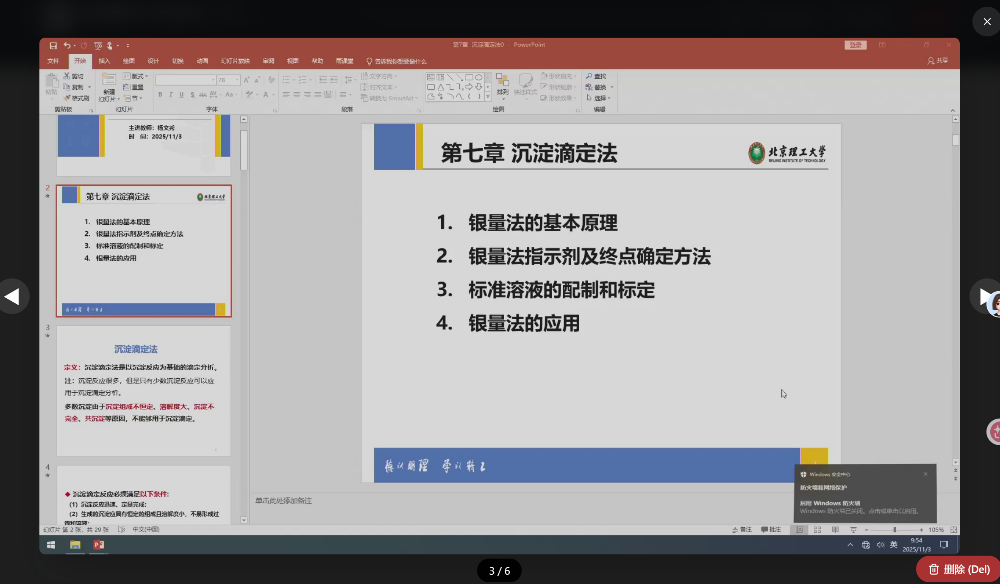
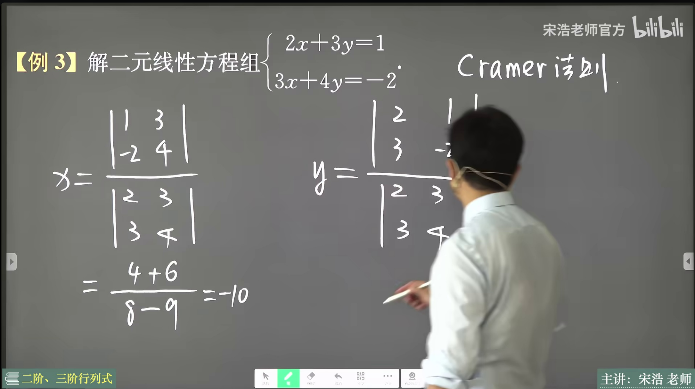
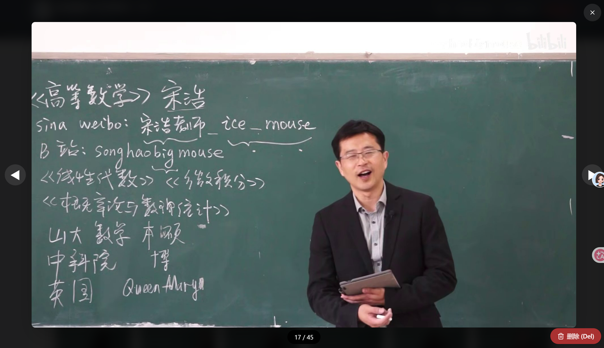

# 影幻智提 (VidSlide)

> 从延河课堂等桌面录屏视频中，一键智能提取 PPT 幻灯片 — 告别截图，告别手动整理。


## 这是什么？

延河课堂的录播视频只能在线看，没有现成的 PPT 下载。  
**影幻智提** 帮你从下载好的桌面录屏视频中，自动识别每一页 PPT 翻页，提取出清晰的幻灯片图片，然后打包成 **PDF / PPTX / ZIP** 供你离线复习。

**30 秒上手**：下载 exe → 双击运行 → 选视频 → 点提取 → 导出 PDF，就这么简单。

> **注意：** 本工具支持三种视频类型 — **PPT 录屏**（纯屏幕录制）、**电子课堂**（PPT + 老师走动）、**实体课堂**（黑板板书 + 老师走动）。在参数面板的「视频类型」下拉框中选择即可。

> **关于「PPT 录屏裁剪」选项：** 该功能是为延河课堂等特定录屏软件设计的 — 这类软件的录屏画面左侧会有 PPT 缩略图标签页列表，裁剪功能会自动忽略这部分区域。如果你的视频是普通的网课录屏（全屏 PPT，没有左侧标签页），请**关闭**「PPT 录屏裁剪」，否则可能导致画面被错误裁切。

## 前置步骤：先获取视频文件

延河课堂的录播视频需要借助浏览器插件下载到本地，**推荐使用 [猫抓 (cat-catch)](https://github.com/xifangczy/cat-catch)**（开源，支持 Chrome / Edge / Firefox）。

> 也可以使用 [Video DownloadHelper](https://www.downloadhelper.net/) 等其他视频下载插件。

### 以猫抓为例

1. 从 [猫抓 GitHub](https://github.com/xifangczy/cat-catch) 或浏览器扩展商店安装猫抓插件
2. 进入延河课堂的**录播课程页面**，刷新页面
3. 点击浏览器工具栏的猫抓图标，会嗅探到**两个视频**：
   - `video1.m3u8` — 这是**摄像头录播**（拍教室的，不需要）
   - `VGA.m3u8` — 这是**屏幕录播**（PPT 画面，我们要下载的）

   

4. 点击 **VGA.m3u8** 旁边的下载按钮
5. 第一次使用猫抓下载时会弹出两个页面，**不用点击任何按钮**，等待猫抓自动完成下载
6. 下载完成后选择保存位置，确认该视频是屏幕录制画面后，即可使用本工具提取 PPT

## 快速开始

### 方式一：下载 exe 直接使用（推荐）

1. 👉 前往 [**Releases**](../../releases) 页面，下载最新版 `VidSlide.exe`
2. 双击运行，浏览器自动打开工具页面
3. 选择视频 → 调参数 → 点击「开始提取」
4. 提取完成后整理排序 → 导出 PDF / PPTX / ZIP

<details>
<summary>⚠️ <b>首次运行遇到 Windows 安全提示？点击展开解决方法</b></summary>

因为本工具是个人开源项目，没有购买商业代码签名证书（年费 $200+），所以 Windows SmartScreen 会弹出警告。**程序本身是安全的**，源码完全公开可审查。

**绕过方法（只需一次）：**
1. 下载 exe 后，Windows 可能提示"已阻止下载" → 点击 **保留**（或点 `···` → 保留）
2. 双击运行时弹出蓝色窗口"Windows 已保护你的电脑" → 点击 **「更多信息」** → 再点击 **「仍要运行」**
</details>

### 方式二：从源码运行

```bash
git clone https://github.com/PWO-CHINA/VidSlide.git
cd VidSlide
python -m venv venv
.\venv\Scripts\activate   # Windows
pip install -r requirements.txt
python app.py
```

## 命令行选项

从源码运行时支持以下命令行参数：

```
python app.py [选项]

选项:
  --port PORT      指定监听端口（默认自动选择 5873 附近的空闲端口）
  --no-browser     启动后不自动打开浏览器
  --help           显示帮助信息

示例:
  python app.py                        # 默认启动，自动打开浏览器
  python app.py --port 8080            # 指定端口 8080
  python app.py --no-browser           # 不自动打开浏览器（适合服务器/脚本场景）
  python app.py --port 8080 --no-browser
```

> **注意：** 打包后的 `VidSlide.exe` 同样支持这些参数，在命令提示符中运行 `VidSlide.exe --help` 即可查看。

## 功能一览

| 功能 | 说明 |
|------|------|
| 🔍 智能场景检测 | 基于 OpenCV 帧差分析自动识别翻页 |
| ✂️ ROI 精准裁剪 | 忽略录屏工具栏和缩略图区域 |
| ⏳ 动态稳定等待 | 等待动画播完再截图，消除重影 |
| 🧹 去重核验 | 自动过滤重复页面 |
| 🖼️ 可视化管理 | 拖拽排序、预览大图、删除/回收站 |
| 📦 多格式导出 | PDF / PPTX / ZIP |
| 🚪 自动退出 | 浏览器断联 5 分钟后自动退出（有任务时延长等待） |
| ⚡ 快速模式 | 缩小比较分辨率至 480p 加速检测（不影响输出质量，可关闭） |
| 📈 实时进度 | 显示百分比、已用时间、预计剩余时间 |
| 🗂️ 多标签页并行 | 同时处理最多 3 个视频，每个标签页独立运行（v0.2.0+） |
| 📊 系统资源监控 | 实时显示 CPU / 内存 / GPU / 磁盘使用率及活跃任务数（v0.2.0+） |
| 🛡️ 安全防护机制 | 资源超限警告、独立缓存隔离、全局一键清理（v0.2.0+） |
| 🎮 GPU 硬件加速 | 支持 GPU 视频解码加速（独显/核显均可），可随时切换 CPU/GPU 模式（v0.3.0+） |
| 📡 SSE 实时推送 | 服务器推送替代轮询，进度更新更及时更省资源（v0.3.0+） |
| 🔄 断连自动恢复 | 后端意外断开时自动重连，刷新页面即可恢复（v0.3.0+） |
| 🎯 三档运行模式 | Eco 后台静默 / Fast 全速狂飙 / Turbo 极速狂暴，根据场景自由选择（v0.3.1+） |
| 🏫 三模式视频类型 | PPT 录屏 / 电子课堂（PPT + 老师走动）/ 实体课堂（黑板 + 老师走动），自动适配不同课堂场景（v0.6.1+） |
| 💾 参数配置记忆 | 自动记住上次的参数选择，下次打开无需重新设置（v0.3.1+） |
| 📡 跨标签页同步 | 关闭服务时所有标签页同步响应，重复标签页自动检测（v0.4.0+） |

## ⚡ 三档运行模式详解

| | 🌿 Eco 后台静默 | 🚀 Fast 全速狂飙 | 💥 Turbo 极速狂暴 |
|:--|:--|:--|:--|
| **适用场景** | 边看网课边提取 | 专心等提取结果 | 赶时间，只要速度 |
| **CPU 占用** | ~30-50% | ~70-90% | ~60-80% |
| **帧跳距** | 1× (按 fps) | 1× (按 fps) | **2×** (跳帧翻倍) |
| **比较分辨率** | 480p | 480p | **320p** (更粗略) |
| **稳定帧检测** | 0.5s × 3次 | 0.5s × 3次 | **0.3s × 1次** |
| **节流间隔** | 8ms | 1ms | 1ms |
| **进程优先级** | 低于正常 | 正常 | 正常 |
| **预计提速** | 基准 | ~1.5× | **~2-3×** |
| **偶尔漏页风险** | 极低 | 极低 | 有一定概率 |

> **💡 选择建议：**
> - 不确定选啥 → **Fast**（速度与质量的最佳平衡）
> - 视频很长、只想快速浏览 → **Turbo**（漏 1-2 页可手动补）
> - 后台挂着慢慢跑 → **Eco**

## 🏫 三模式视频类型详解

不同类型的课程视频有不同的画面特征，需要不同的提取策略。在参数面板的「视频类型」下拉框中选择对应模式即可。

### 三种典型画面

**📺 PPT 录屏** — 延河课堂等桌面录屏，画面中只有 PPT 幻灯片（可能带左侧缩略图栏），无人物出现：



**🖥️ 电子课堂** — PPT 上有印刷内容和手写板书，老师在画面中走动或书写（如 B 站宋浩老师的线性代数系列）：



**🏫 实体课堂** — 纯黑板/白板 + 老师走动，无 PPT 投影（如 B 站宋浩老师的高等数学系列）：



### 模式对比

| | 📺 PPT 录屏 | 🖥️ 电子课堂 | 🏫 实体课堂 |
|:--|:--|:--|:--|
| **典型场景** | 纯屏幕录制，无人物 | PPT + 老师手写板书 | 黑板板书 + 老师走动 |
| **人物遮罩** | 关闭 | 开启（MOG2 背景建模） | 开启（MOG2 背景建模） |
| **稳定帧检测** | 开启（等动画播完再截图） | 关闭（翻页即截） | 关闭（变化即截） |
| **采样间隔** | 1-2 秒 | 3 秒 | 5-10 秒 |
| **输出质量** | 95% JPEG | 95% JPEG | 85% JPEG |

### 工作原理

#### 场景检测：如何判断"翻页了"

所有模式共用同一个「灵敏度阈值」（默认 5.0，滑块可调）。每隔一定帧数，工具会比较当前帧和上一帧的灰度图差异：

```
差异值 = 所有参与比较的像素的平均亮度差
如果 差异值 > 阈值 → 判定为翻页，触发截图
```

**关键区别：** 在 PPT 录屏模式下，"所有像素"就是整个画面；而在电子课堂和实体课堂模式下，走动的老师区域会被 MOG2 遮罩排除，只有背景（PPT/黑板）区域的像素参与比较。因此，**同样的阈值 5.0，在有遮罩的模式下不会被人物走动误触发，只响应真正的内容变化。**

#### MOG2 人物遮罩：如何"看穿"老师

电子课堂和实体课堂模式使用 OpenCV 的 MOG2（Mixture of Gaussians）背景减除算法来过滤画面中走动的人物：

1. **建立背景模型**：MOG2 为画面中每个像素维护一个高斯混合模型，记录该位置"通常是什么颜色"
2. **预训练阶段**：提取开始前，先快速扫描视频中所有关键帧（不提取，只让 MOG2 学习），建立稳定的背景模型
3. **前景检测**：提取过程中，MOG2 将每个像素与背景模型比较 — 如果偏差大则判定为"前景"（移动物体，即老师）
4. **形态学处理**：对前景遮罩进行闭运算（填充老师轮廓内的空洞）和膨胀（扩大遮罩范围，确保边缘不漏）
5. **近乎冻结**：预训练完成后，学习率降至极低（0.005），防止老师长时间站在同一位置被"吸收"进背景

最终效果：比较画面差异时，老师占据的区域被遮罩覆盖、不参与计算，只有 PPT 或黑板上的内容变化才会触发提取。

#### 稳定帧检测：为什么电子课堂要关闭

PPT 录屏模式启用了「稳定帧检测」— 检测到翻页后不立即截图，而是继续读取后续帧，等画面稳定后再截。这是因为 PPT 幻灯片常有淡入淡出等过渡动画，需要等动画播完才能截到完整页面。

但在电子课堂中，这个机制会导致"超调"：

> 老师写完答案 → 画面变化触发检测 → 系统等画面稳定 → 等的过程中老师翻到下一页 → 画面再次稳定 → **截到的是下一页，答案页丢失**

因此电子课堂和实体课堂都关闭稳定帧检测，**检测到变化就立即截图**，确保每一页内容都能被捕获。

#### 采样间隔：为什么不同

- **PPT 录屏（1-2 秒）**：翻页是瞬间完成的，需要密集采样避免漏页
- **电子课堂（3 秒）**：PPT 翻页 + 板书书写，需要较短间隔捕捉翻页，同时过滤掉书写过程中的微小变化
- **实体课堂（5-10 秒）**：黑板板书变化缓慢，大间隔采样即可，避免提取过多中间状态

### 选择建议

- 延河课堂等桌面录屏，画面中没有人物 → **PPT 录屏**
- PPT 画面上有手写板书，老师在旁边走动 → **电子课堂**
- 纯黑板/白板 + 老师走动，无 PPT → **实体课堂**
- 不确定选哪个 → 先用 **PPT 录屏** 试试，如果老师走动导致重复截图多，再换模式

## 💻 推荐设置

### 核显用户（Intel Iris Xe / AMD 集成显卡）

核显的视频解码加速效果有限，**推荐组合**：
- ✅ 运行模式：**Turbo** 或 **Fast**
- ✅ GPU 加速：**关闭**（核显解码可能反而更慢）
- ✅ 快速模式：**开启**
- ✅ 阈值：默认 5 即可，提取少了就降低，重复多了就提高

### 独显用户（NVIDIA / AMD 独立显卡）

独显硬件解码能显著降低 CPU 负担：
- ✅ 运行模式：**Fast** 或 **Turbo**
- ✅ GPU 加速：**开启**
- ✅ 快速模式：**开启**

### 电子课堂用户（PPT + 老师走动/板书）

PPT 翻页 + 老师在旁边书写或走动的视频，**推荐组合**：
- ✅ 视频类型：**电子课堂**（核心，遮罩老师 + 翻页即截）
- ✅ PPT 录屏裁剪：**关闭**（全屏画面无需裁剪）
- ✅ 运行模式：**Fast**
- ✅ 快速模式：**开启**
- ✅ 阈值：默认 5，截图过多可适当提高

### 实体课堂用户（固定机位拍摄黑板/白板）

老师在画面中走动的纯黑板课堂实拍视频，**推荐组合**：
- ✅ 视频类型：**实体课堂**（核心，忽略老师走动）
- ✅ PPT 录屏裁剪：**关闭**（全屏画面无需裁剪）
- ✅ 运行模式：**Fast**
- ✅ 快速模式：**开启**
- ✅ 阈值：默认 5，视板书密度酌情调整

## 自行打包 .exe

### 方式 A：Nuitka 编译（推荐，原生 C 编译，启动更快）

```bash
# 在虚拟环境中
pip install -r requirements.txt
pip install nuitka
# 运行 Nuitka 打包脚本
build_nuitka.bat
# 或手动执行（首次会自动下载 MinGW64 编译器，约 10-20 分钟）
python -m nuitka --onefile --windows-console-mode=disable --windows-icon-from-ico=logo.ico --include-data-dir=templates=templates --assume-yes-for-downloading --output-dir=dist --output-filename=VidSlide.exe app.py
```

### 方式 B：PyInstaller 打包（备选，速度快但启动稍慢）

```bash
pip install -r requirements.txt
pip install pyinstaller
# 运行 PyInstaller 打包脚本
build.bat
# 或手动执行
pyinstaller --onefile --noconsole --icon="logo.ico" --version-file="version.txt" --add-data "templates;templates" --add-data "static;static" --hidden-import extractor --hidden-import exporter --name "VidSlide" app.py
```

## 项目结构

```
VidSlide/
├── app.py              # Flask 后端（多会话 + SSE 推送 + 资源监控）
├── batch_manager.py    # 批量处理任务调度器（三区域状态机）
├── extractor.py        # 视频提取核心（GPU 加速 + 进程优先级调整）
├── exporter.py         # 打包导出（PDF / PPTX / ZIP）
├── templates/
│   └── index.html      # 前端页面模板
├── static/
│   ├── favicon.svg     # 浏览器标签页图标
│   ├── logo.png        # 页眉 Logo
│   ├── css/
│   │   └── style.css   # 外部样式表
│   └── js/
│       ├── main.js     # 标签页模式主逻辑（SSE + 画廊 + 导出）
│       └── batch/      # 批量处理模块（v0.5.2+）
│           ├── core.js       # 批量模式入口 + 全局状态
│           ├── zones.js      # 三区域渲染（未选中 / 队列 / 已完成）
│           ├── select.js     # 视频勾选与批量导出选择
│           ├── controls.js   # 开始 / 暂停 / 跳过控制
│           ├── detail.js     # 详情页（画廊 + 删除 + 导出）
│           ├── naming.js     # 命名弹窗与批量命名模板
│           ├── export.js     # 批量导出逻辑
│           └── recycle.js    # 视频回收站
├── docs/
│   └── cat-catch-demo.png    # 文档配图
├── logo.ico            # Windows 应用图标（打包用）
├── version.txt         # exe 版本信息
├── requirements.txt    # Python 依赖
├── build_nuitka.bat    # Nuitka 打包脚本（推荐）
├── build.bat           # PyInstaller 打包脚本（备选）
└── start_dev.bat       # 开发模式启动
```

## 常见问题

<details>
<summary><b>提取速度太慢怎么办？</b></summary>

1. 切换到 **Turbo** 或 **Fast** 模式（参数面板下拉选择）
2. 核显用户建议**关闭 GPU 加速**（核显解码可能反而拖慢速度）
3. 确保**快速模式**已开启（降低比较分辨率，不影响输出画质）
</details>

<details>
<summary><b>提取出来的页面有遗漏怎么办？</b></summary>

1. 适当**降低阈值**（默认 5，可降到 3-4 提高翻页灵敏度）
2. 如果使用的是 Turbo 模式，切换到 **Fast** 模式重新提取（Turbo 跳帧较大，偶尔会漏页）
3. **关闭「PPT 录屏裁剪」**：如果你的视频不是延河课堂等带左侧标签页的录屏，而是普通的全屏网课录屏，开启裁剪会导致画面被错误裁切，从而漏检大量页面。关闭此选项后重新提取即可。
</details>

<details>
<summary><b>提取出来的页面有重复怎么办？</b></summary>

重复页面有两种情况：

**连续重复**（相邻两页一样）：适当**提高阈值**（从默认 5 提到 6-8），让检测更严格。

**隔页重复**（A→B→A 来回跳页）：开启**历史记忆池**（v0.4.0 已默认开启），记忆池会记住最近提取过的页面，自动跳过重复。如果仍有重复，可适当增大记忆池容量。

手动处理：重复的页面也可以在画廊中点选后删除，或在大图预览中直接删除。
</details>

<details>
<summary><b>exe 打开后浏览器没有自动弹出？</b></summary>

手动在浏览器中输入 `http://127.0.0.1:5875` 即可打开。如果端口被占用，程序会自动切换到其他端口，请查看托盘或控制台提示。
</details>

<details>
<summary><b>杀毒软件报毒怎么办？</b></summary>

这是 PyInstaller 打包的通病，不是真的有病毒。可以：
1. 在杀毒软件中添加 `VidSlide.exe` 为信任/例外
2. 或从源码运行（`python app.py`），完全避免这个问题
</details>

<details>
<summary><b>提示「后端服务已断开」怎么办？</b></summary>

这说明后端进程已退出（可能是手动关闭、系统休眠、或意外崩溃）。解决方法：
1. 重新双击 `VidSlide.exe`（或在终端运行 `python app.py`）启动后端
2. 回到浏览器页面，点击「检测并刷新」按钮
3. 如果频繁出现此问题，请截图终端错误信息并 [提交 Issue](../../issues/new)
</details>

## 关于代码

本项目绝大部分代码由 **GitHub Copilot (Claude Opus 4.6)** AI 生成，由 [PWO-CHINA](https://github.com/PWO-CHINA) 审核、测试和维护。

## 更新日志

### v0.6.0 (2026-02-27) — 视觉风格全面重构版

**界面重构：**
- 🎨 **极简毛玻璃 AI 风**：全面升级为冷调钛金蓝色系（Slate Blue），替换原高饱和 Indigo 风格
- 🖼️ **Lucide SVG 图标**：全面替换 Unicode Emoji 为线性 SVG 图标，解决跨平台渲染不一致问题
- 🪟 **毛玻璃面板**：页眉与控制栏采用 `backdrop-filter: blur(16px)` 毛玻璃效果
- 🔘 **iOS 风格开关**：所有 checkbox 升级为纯 CSS 实现的滑动开关
- 📊 **进度条焕新**：6px 细线进度条 + 双色渐变 shimmer 动画
- 🎚️ **细线滑块**：场景检测灵敏度滑块升级为 4px 轨道极简风格
- 🖼️ **自定义 favicon**：浏览器标签页图标替换为项目专属 SVG 图标

**Bug 修复：**
- 🔧 **修复详情页导出图标缺失**：批量模式详情页导出按钮（ZIP / PDF / PPTX）补全 Lucide 图标
- 🔧 **修复回收站图标消失**：详情页回收站按钮改用静态 SVG，避免动态刷新时图标消失

### v0.5.3 (2026-02-27) — 三区域重构版

**架构重构：**
- 🏗️ **三区域模型**：将视频队列彻底拆分为「未选中」「处理队列」「已完成」三个独立区域，状态流转清晰可控
- 🔧 **调度器受控模式**：队列不再自动消费，必须用户点击「开始处理」才会启动，彻底修复跳过/暂停后自动重新开始的 bug
- 📦 **前端模块化拆分**：原 `batch.js` 单文件拆分为 core / zones / select / controls / detail / naming / export / recycle 八个独立模块，提高可维护性

**新增功能：**
- 🗑️ **视频回收站增强**：回收站支持三种恢复方式 — 重置到未选中 / 断点续传到队列 / 直接恢复到已完成
- 🖼️ **图片回收站实时刷新**：删除/恢复图片时，已展开的回收站面板实时更新内容
- ⏸️ **处理完当前视频后暂停**：替代原来的暂停机制，当前视频继续完成，不启动新视频

**界面优化：**
- 🎨 **回收站按钮位置调整**：详情页回收站按钮移至导出按钮左侧，更易发现
- 📝 **README 新增 PPT 裁剪说明**：明确说明「PPT 录屏裁剪」仅适用于延河课堂等带左侧标签页的录屏，普通网课录屏应关闭此选项

### v0.5.2-beta (2026-02-26) — 批量处理实验版

> ⚠️ **实验性版本**：线性队列处理（批量模式）为实验性功能，处理流程中可能遇到 bug。如遇问题请在 [Issues](../../issues) 中反馈。稳定版请使用 v0.4.1。

**新增功能：**
- 📦 **批量处理模式**：支持多视频排队处理，可设置并发数（1-3），处理完成后浏览器通知
- 📝 **智能命名系统**：添加视频时支持三种命名方式 — 保留原名 / 命名模板 / 自由编辑，支持自动递增
- 🖼️ **命名弹窗缩略图**：添加视频时显示首帧缩略图，方便辨别视频内容
- 🔀 **命名排序**：命名弹窗支持按名称升序/降序排列
- 📊 **全局进度条**：统计所有视频（等待/处理中/已完成）的整体进度，显示百分比和预计剩余时间
- 🗑️ **视频回收站**：已完成/已取消的视频可移入回收站，支持恢复
- 🖼️ **图片软删除**：批量详情中删除图片改为软删除，支持 Ctrl+Z 撤销和回收站恢复
- ✅ **批量导出选择**：已完成视频支持勾选，可选择性导出部分视频
- 🔄 **拖拽排序**：视频队列和命名列表均支持拖拽调整顺序

**批量控制优化：**
- ⏸️ **暂停/跳过/取消分离**：运行中视频可暂停（保留已提取图片），排队中视频可跳过，三种状态语义清晰
- 🔁 **重新排队修复**：修复暂停/取消后重新排队立即完成的严重 bug（cancel_flag 未重置）
- 🏷️ **paused 独立状态**：暂停的视频显示"已暂停"橙色标签，与"已取消"区分

**界面优化：**
- 🎨 **批量面板视觉统一**：颜色、圆角、阴影、字体与标签页模式保持一致
- 📏 **面板宽度统一**：批量面板从 max-w-7xl 改为 max-w-5xl
- 🔢 **编号式区域标题**：全局参数/视频队列/批量导出使用编号圆圈标题
- ✕ **命名弹窗关闭优化**：支持点击 × 按钮、点击遮罩、ESC 键关闭
- 🔘 **按钮可见性修复**：修复日间模式下弹窗内按钮不可见的问题
- 📊 **导出计数修复**：修复视频移入回收站后导出选择计数不更新的问题

### v0.4.1 (2026-02-26) — 细节优化版
- 🖼️ **图标更新**：替换为新版高清图标（256x256）
- 🏷️ **任务管理器名称修正**：修复打开文件选择弹窗时任务管理器中程序名称变为"请选择上传一个视频"的问题，现在始终显示"影幻智提 (VidSlide)"
- ↺ **参数重置按钮**：参数面板底部新增"重置为默认参数"按钮，一键恢复所有参数并清除记忆
- ⌨️ **大图预览支持 Ctrl+Z**：在大图预览模式下也可以用 Ctrl+Z 撤回刚刚删除的图片
- 🖥️ **命令行参数支持**：新增 `--port`、`--no-browser` 参数，支持指定端口和禁用自动打开浏览器（详见[命令行选项](#命令行选项)）

### v0.4.0 (2026-02-25) — 体验优化版
- 🎨 **状态栏合并进页眉**：资源监控条移入 sticky header 内部，消除阴影遮挡，视觉更整洁
- 🌙 **深色模式 Logo 优化**：Logo 不再粗暴反色，改为柔和降亮 `brightness(0.85) saturate(0.9)`
- 💬 **错误提示用户友好化**：`网络错误: Failed to fetch` 改为「无法连接到后端服务」，后端断开时不再重复弹 toast
- 🔄 **智能刷新替代盲刷新**：断连弹窗的「立即刷新」改为「检测并刷新」，先 ping 后端再决定是否 reload，避免跳到浏览器「拒绝连接」死页面
- ⏱️ **自动重连上限**：自动重连最多尝试 30 次（约 2.5 分钟），超时后停止并提示手动重启
- 🔇 **抑制 Flask 开发服务器警告**：终端不再显示 `WARNING: This is a development server` 无关提示
- 📡 **跨标签页关闭同步**：关闭服务时通过 BroadcastChannel 通知所有浏览器标签页同步显示关闭页面，不再出现一个已关闭另一个显示断连的问题
- 🔁 **重复标签页检测**：打开新浏览器标签页时自动检测是否已有标签页在运行，避免会话冲突；支持「强制打开」和「不再提示」
- ⏳ **关闭后自动关闭页面**：关闭服务后显示 5 秒倒计时，尝试自动关闭浏览器标签页
- 🧠 **历史记忆池默认开启**：防止 A→B→A 跳页重复提取的历史记忆池现在默认启用

### v0.3.2 (2026-02-25) — 稳定性修复版

<details>
<summary>点击展开</summary>

- 🔒 **文件选择弹窗互斥**：多标签页同时点击「浏览选择视频」时，第二个标签页立即提示「其他标签页正在选择文件」，不再卡死超时
- 🔁 **SSE 僵尸连接防护**：前端 EventSource 连续出错 3 次后主动放弃重连，避免后端会话已清理时的无限 404 刷屏
- 🛡️ **提取线程异常兜底**：`_extraction_worker` 外层包裹全局 `try/except`，任何未知崩溃（OpenCV 崩溃、OOM 等）都会向前端推送错误状态，不再死等
- 🧹 **孤儿会话自动清理**：无活跃 SSE 连接的残留会话超时后自动回收，不再占用标签页名额
- 📊 **动态最大标签页数**：根据 CPU 核数和内存总量在启动时自动计算最大并行标签页数（最少 2，最多 8）
- 🔧 **Nuitka 打包修复**：`build_nuitka.bat` 补上漏掉的 `--include-data-dir=static=static`，修复打包后缺少静态资源的问题
</details>

### v0.3.1 (2026-02-25) — 性能狂飙版

<details>
<summary>点击展开</summary>

- ⚡ **三档运行模式**：Eco 后台静默 / Fast 全速狂飙 / Turbo 极速狂暴，根据场景自由切换
  - Eco：降低优先级 + 8ms 节流，后台挂机无感
  - Fast：保持正常优先级 + 1ms 微小节流，释放全部算力
  - Turbo：在 Fast 基础上，2x 帧跳距 + 320p 超低分辨率对比 + 加速稳定帧检测，理论提速 40-50%
- 💾 **参数配置记忆**：localStorage 自动保存/恢复所有提取参数，下次打开无需重新设置
- 💡 **核显性能提示**：参数区新增智能提示，引导核显用户使用「Turbo + 关闭 GPU」极速组合
- 🗑️ **删除按钮优化**：大图预览删除按钮移至右下角，改为胶囊样式 `🗑️ 删除 (Del)`，不再被 Toast 遮挡
- 🛡️ **内存溢出防护**：每 500 帧强制 `gc.collect()`，防止 Fast/Turbo 模式下帧数组堆积导致 OOM
- 👁️ **预览导航优化**：第一张隐藏左箭头，最后一张隐藏右箭头
</details>

### v0.3.0 (2026-02-25) — 性能优化版

<details>
<summary>点击展开</summary>

- 📡 **SSE 服务器推送**：用 Server-Sent Events 替代高频 HTTP 轮询，进度更新更及时、资源消耗更低
- ⚡ **异步后台打包**：PDF/PPTX/ZIP 打包在后台线程异步执行，前端通过 SSE 实时显示打包进度
- 🎮 **GPU 硬件加速**：视频解码自动检测并使用 GPU 加速，提取速度大幅提升
- 🔀 **GPU/CPU 切换开关**：参数面板新增硬件加速开关，遇到兼容性问题可随时切回 CPU 模式
- 📊 **GPU 实时监控**：资源监控栏新增 GPU 使用率、显存占用显示（支持 NVIDIA 独显 + Intel/AMD 核显，通过 Windows PDH 通配符计数器自动追踪）
- 🗑️ **大图预览内删除**：预览模式新增删除按钮，删除后自动跳转下一张，无需退出预览
- ❤️ **心跳超时优化**：超时从 20 秒提升至 5 分钟，新增 `visibilitychange` 事件防止浏览器后台节流导致误判退出
- 🛡️ **智能退出保护**：有活跃任务或未导出成果时，即使心跳超时也不会退出
- 🔄 **断连自动重连**：后端意外断开时自动每 5 秒尝试重连，恢复后自动刷新页面
- 🔌 **端口持久化**：记录上次使用的端口，刷新浏览器时自动连回同一端口
- 🔧 **进程优先级降低**：自动降低提取进程优先级，减少对前台应用的影响
- 🏗️ **代码 MVC 拆分**：拆分为 `extractor.py`（提取核心）+ `exporter.py`（打包导出）+ `app.py`（路由控制）
- 🎨 **前端代码拆分**：CSS/JS 独立为外部文件，HTML 模板更清爽
- ⚡ **DocumentFragment 优化**：画廊渲染使用 DocumentFragment 批量插入，浏览器只重绘一次
</details>

### v0.2.1 (2026-02-25)

<details>
<summary>点击展开</summary>

- 🐛 **取消提取后画廊正常显示**：修复点击「取消提取」后已提取的图片不显示在画廊的 Bug
- 🐛 **取消后 Worker 立即停止**：`cancel_flag` 检查扩展到 4 个关键位置，消除取消后 CPU 空转
- ⚡ **CPU 占用优化**：提取主循环和稳定帧子循环各加入 8ms 节流，峰值 CPU 从 99% 降至 ~70-80%
- ⚡ **资源及时释放**：Worker 退出改用 `try/finally` 统一释放 + `gc.collect()` 强制回收
- ⚡ **后台 CPU 采样**：系统资源监控改为后台线程采样，API 不再阻塞
- ⚡ **轮询降频**：自适应轮询（运行时 800ms，空闲自动停止）
- 🛡️ **鲁棒性增强**：所有 API 返回结构化错误信息 + 操作建议
- 🐛 **视频预检测**：开始提取前检测编解码器，文件损坏时给出明确提示
- 📋 **错误弹窗 + Issue 提交**：出错时弹出详情弹窗，含预填内容的「提交 Issue」快捷按钮
- 🏗️ **Nuitka 打包支持**：新增 `build_nuitka.bat`，支持 C 语言级别原生编译
</details>

### v0.2.0 (2026-02-24)

<details>
<summary>点击展开</summary>

- 🗂️ **多标签页并行处理**：支持同时打开最多 3 个标签页，每个标签页独立处理
- 📊 **系统资源监控**：实时显示 CPU / 内存 / 磁盘使用率及活跃任务数
- 🛡️ **资源安全警告**：CPU > 90% / 内存 > 85% / 磁盘剩余 < 500MB 时自动弹出警告
- 🔒 **独立会话隔离**：每个标签页拥有独立缓存目录
- 🧹 **全局一键清理**：一键关闭所有会话并清理临时文件
- 🏗️ **后端多会话架构**：重构为 UUID-based 多会话系统
</details>

### v0.1.x (2026-02-24)

<details>
<summary>点击展开</summary>

- **v0.1.2**：修复刷新崩溃、断连友好提示、心跳超时优化
- **v0.1.1**：`grab()` 顺序跳帧 3-10 倍提速、进度估算、快速模式、无控制台窗口
- **v0.1.0**：首个公开测试版
</details>

## 隐私

所有处理均在本地完成，不上传任何数据。临时文件在关闭浏览器后自动清理。

## 许可证

[MIT License](LICENSE)
